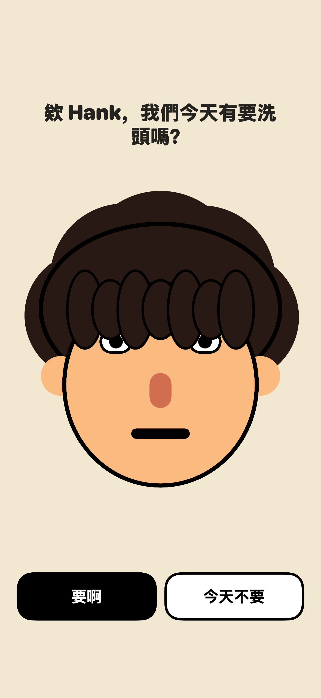

# 洗頭了沒

一顆會依你洗不洗頭而改變的巨大頭。這是一天內完成、讓家人能直接玩的原生 iOS SwiftUI Demo；不是健康追蹤器，也不會對沒洗頭說教。

## 已實作

- 巨大 2D SwiftUI 角色頭
- 中央彈出式「今天要洗頭嗎？」主流程
- 不洗時頭髮逐次膨脹，最高三段
- 拖曳外觀像澆花器的蓮蓬頭，把頭髮逐步澆濕
- 洗完確認與「其實還沒」分支
- 洗頭途中離開的二次確認；確定離開會記成沒洗
- 「不要再提醒我，我很誠實」信任選項
- 可更正每日結果的月曆
- 膚色、髮色、髮型、臉型與五官調整
- 每週七天洗澡時間、睡前 unknown 與可直接回答的本機通知
- 乾淨、澎、最大與 unknown 四種 App icon
- @AppStorage / UserDefaults 本機持久化

一天版原始規格見 [PRODUCT_BRIEF.md](PRODUCT_BRIEF.md)，長期方向見 [LONG_TERM_PRODUCT_SPEC.md](LONG_TERM_PRODUCT_SPEC.md)，目前驗證狀態見 [DEV_STATUS.md](DEV_STATUS.md)。明天在 Mac 開始前先照 [MAC_ACCEPTANCE_CHECKLIST.md](MAC_ACCEPTANCE_CHECKLIST.md) 驗收。

## 在 Mac 上執行

1. 用 Xcode 開啟 WashHead.xcodeproj。
2. 選擇 WashHead scheme 與任一 iPhone Simulator。
3. 按 ⌘R。

若要裝到實機，在 target 的 Signing & Capabilities 選擇自己的 Apple Development Team；必要時把 bundle identifier 改成自己帳號下唯一的值。

最低部署版本是 iOS 17；目前用 Xcode 26／iOS 26 SDK 開發與驗收。這兩件事不衝突：iOS 17 是 App 可安裝的最低系統，iOS 26 SDK 是現在拿來編譯與測試的工具版本。

## 只有 Windows 時

Windows 可以編輯所有程式與文件、commit/push，並透過本 repo 的 GitHub Actions 讓 macOS runner 執行無簽章的 Simulator build。

Windows 本機不能：

- 安裝或執行 Xcode
- 開啟 iOS Simulator / SwiftUI Preview
- 編譯這個 SwiftUI iOS target
- 簽署並安裝到 iPhone

因此 CI 綠燈代表「能編譯」，不代表觸控手感已驗證。最終互動測試仍需 Mac 或可遠端操作的 Mac。

參考：[Apple Xcode 系統需求](https://developer.apple.com/xcode/system-requirements/) · [GitHub-hosted runners](https://docs.github.com/en/actions/reference/runners/github-hosted-runners)

## CI

每次 push / pull request 都會在 arm64 `macos-26` runner，以 Xcode 26.6／iOS 26 SDK 執行：

~~~sh
xcodebuild \
  -project WashHead.xcodeproj \
  -scheme WashHead \
  -configuration Debug \
  -destination 'generic/platform=iOS Simulator' \
  CODE_SIGNING_ALLOWED=NO \
  build
~~~
